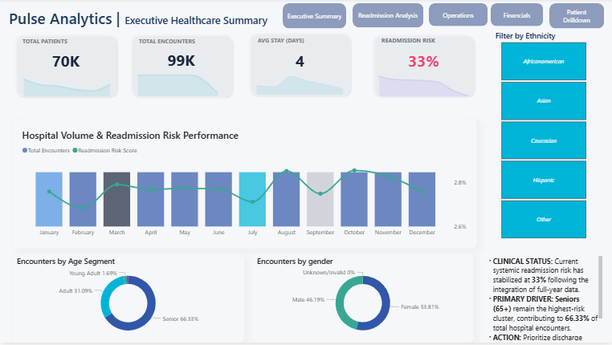
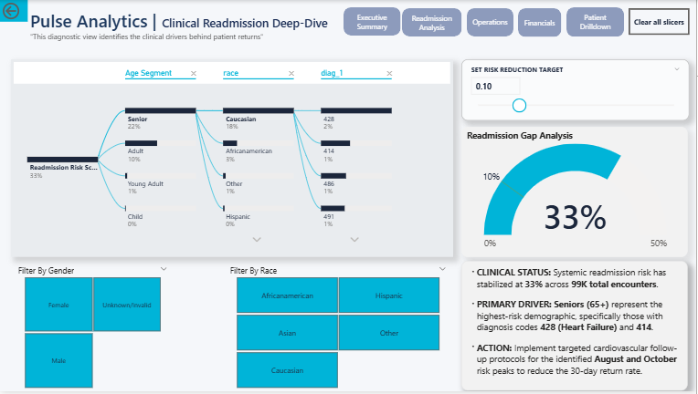
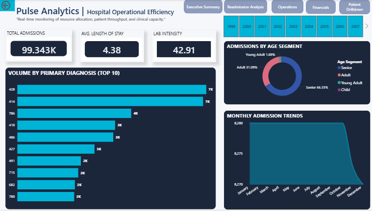
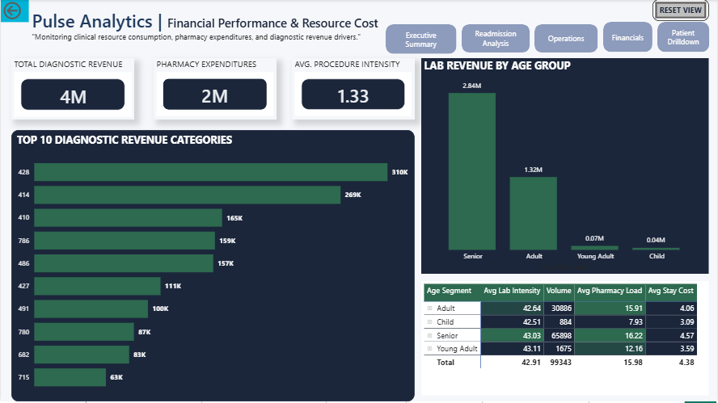
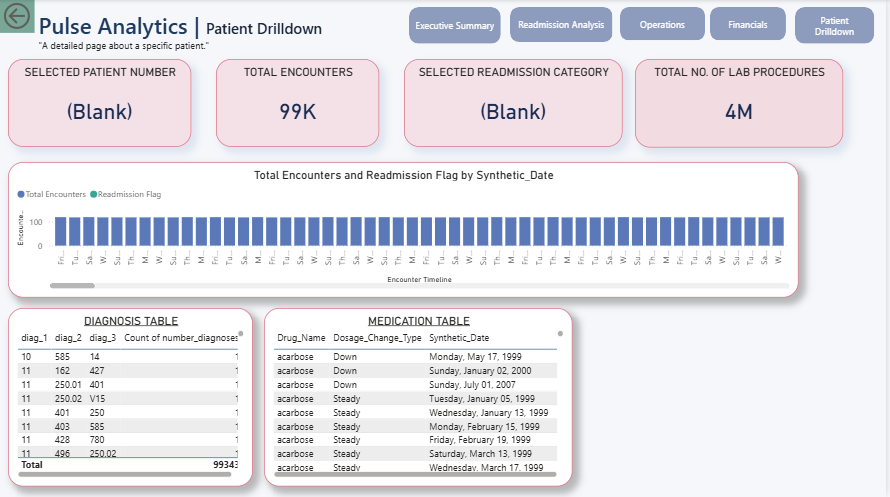

# PulseAnalytics: A Strategic BI Framework for Hospital Readmission & Clinical Resource Optimization

## Table of Contents
1. [Problem Statement](#1-problem-statement)
2. [Project Directory](#2-project-directory)
3. [Strategic Business Questions](#3-strategic-business-questions)
4. [Data Source & Characteristics](#4-data-source--characteristics)
5. [Technical Workflow](#5-technical-workflow)
    * [Data Cleaning & Transformation](#data-cleaning--transformation)
    * [Data Modeling (Star Schema)](#data-modeling-star-schema)
    * [DAX Calculations & Measures](#dax-calculations--measures)
6. [Dashboard Pages Overview](#6-dashboard-pages-overview)
7. [Key Insights](#7-key-insights)
8. [Strategic Recommendations](#8-strategic-recommendations)
9. [Project Resources](#9-project-resources)
10. [Contributors](#10-contributors)

---

## 1. Problem Statement
Hospital readmissions, particularly within 30 days of discharge, remain one of the most critical challenges in modern healthcare systems. High readmission rates contribute to increased operational costs, regulatory penalties, and compromised patient outcomes. 

This project implements an end-to-end Business Intelligence (BI) solution that transforms 10 years of U.S. hospital clinical data into actionable insights to:
* Identify high-risk patient segments.
* Reduce avoidable 30-day readmissions.
* Optimize clinical resource allocation.
* Support data-driven healthcare decision-making.

---

## 2. Project Directory
To ensure a professional and organized repository, the project is structured as follows:

| Folder/File | Description |
| :--- | :--- |
| `dashboard_images/` | Screenshots of all Power BI dashboard pages. |
| `Data/` | Source dataset (`diabetic_data.csv`). |
| `Documentation/` | Technical guides: `Documented_transformations.pdf` and `Documented_modelling.pdf`. |
| `Reports/` | Final business deliverables: `Hospital_Performance_Report.pdf`. |
| `PulseAnalytics.pbix` | Core Power BI file (Data Model & Visualizations). |

---

## 3. Strategic Business Questions
1. **Readmission Risk & Equity Gap:** What is the baseline 30-day readmission rate, and what is the "gap" between our highest-risk (35%) and best-performing (23%) segments?
2. **Seasonal Volume & Timing:** Are there specific months where clinical pressure spikes, necessitating resource reallocation?
3. **Clinical Intensity & Resource Load:** Is there a correlation between high-intensity interventions (medications/labs) and the likelihood of returning within 30 days?
4. **Operational Consistency:** Which primary diagnoses (e.g., Heart Failure - 428) consistently drive hospital volume and ALOS?
5. **Financial Impact:** How does the cost of care scale within our largest patient demographic, the senior population?

---

## 4. Data Source & Characteristics
* **Source:** [UCI Machine Learning Repository - Diabetes 130-US Hospitals](https://archive.ics.uci.edu/dataset/296/diabetes+130-us+hospitals+for+years+1999-2008)
* **Dataset Characteristics:**
    * 101,766 patient admission records.
    * 50+ clinical and administrative variables.
    * Numerical measures: Lab Procedures, Medication Count, Length of Stay.
    * Categorical attributes: Race, Gender, Specialty, Payer Code.

---

## 5. Technical Workflow

### Data Cleaning & Transformation
The raw dataset was processed using **Power Query (M)** to ensure clinical accuracy and model efficiency. Our transformation strategy focused on standardizing categorical labels and converting text-based clinical ranges into usable numeric measures.

#### **I. Core Identifiers & Demographics**
* **IDs (Columns 1 & 2):** Converted `encounter_id` and `patient_nbr` from Numbers to **Text**. This prevents accidental aggregation (summing IDs) and keeps the data model lean.
* **Race (Column 3):** Replaced `?` placeholders with **"Other"**. Applied *Trim* and *Capitalize Each Word* to ensure consistent grouping for demographic gap analysis.
* **Gender (Column 4):** Standardized casing and removed "Unknown/Invalid" records to maintain a high-quality, verified clinical dataset.
* **Age (Column 5):** Stripped mathematical symbols `[ )`, split ranges, and calculated an **Age_Midpoint**. This transformed unusable text brackets into numeric values for advanced DAX correlations.
* **Weight (Column 6):** Dropped entirely. Research confirmed 97% missing data; removing this "noise" optimized file size and model performance.

#### **II. Clinical & Operational Logic**
* **Mortality Filtering (Column 8):** Implemented a strict row filter to exclude `discharge_disposition_id` codes associated with expired patients (11, 13, 14, 19, 20, 21). This ensures risk calculations only apply to the "at-risk" living population.
* **Hospital Metrics (Columns 10-18):** Validated `time_in_hospital` and health utilization counts as **Whole Numbers**. This enables the calculation of **Average Length of Stay (ALOS)** and resource intensity metrics.
* **Specialty & Payer (Columns 11-12):** Replaced `?` with **"Not Specified"**. We chose to retain these to analyze known segments (e.g., Medicare vs. Private) rather than losing 50% of the departmental volume data.

#### **III. Diagnostics & Medication Tracking**
* **ICD-9 Codes (Columns 19-21):** Strictly cast `diag_1`, `diag_2`, and `diag_3` as **Text**. This prevents Power BI from dropping leading/trailing zeros or corrupting alphanumeric codes (V-codes/E-codes).
* **Lab Results (Columns 23-24):** Replaced "None" with **"Not Tested"**. This semantic correction distinguishes between a "missing" value and a deliberate clinical decision to omit a test.
* **Pharmacy Load (Columns 25-47):** Bulk-validated 20+ medication dosage columns as **Text**. This categorical tracking allows us to analyze how "Polypharmacy" (high drug counts) or dosage changes impact returns.
* **Readmission Labels (Target Variable):** Transformed raw system outputs into executive-ready labels:
    * `<30` → **"Under 30 Days"**
    * `>30` → **"Over 30 Days"**
    * `NO` → **"Not Readmitted"**

> **Technical Deep-Dive:** [View Documented Transformations & M-Code (PDF)](./Documentation/Documented_transformations.pdf) | [Download (PDF)](./Documentation/Documented_transformations.pdf?raw=true)

---

### Data Modeling Strategy (Star Schema)

To enable performant DAX calculations and intuitive filtering, the flat dataset was restructured into a **Star Schema**. All dimension tables were created using the **"Reference"** method in Power Query to maintain a single source of truth and ensure a dynamic data lineage.

#### **I. The Fact Table: `Fact_Encounter`**
This is the core of our model, containing quantitative measures and foreign keys. 
* **Attributes:** Includes `time_in_hospital`, `num_lab_procedures`, `num_medications`, and the `readmitted` target variable.
* **Synthetic Date Logic:** Generated a stable, unique `Synthetic_Date` for every encounter using an index-based formula. This ensures each record has a fixed point in time (1999–2008) for time-intelligence analysis without row-shuffling during refreshes.

#### **II. Dimension Tables**
* **`Dim_Patient`:** Stores unique patient demographics. We removed duplicate `patient_nbr` rows to ensure a strict **1:N (One-to-Many)** relationship, allowing us to track the longitudinal journey of a single patient across multiple hospital visits.
* **`Dim_Admission`:** Categorizes hospital entry and exit logic. We utilized **Composite Keys** (`Admission_Key`) to link complex combinations of admission type, source, and discharge disposition to the fact table.
* **`Dim_Diagnosis`:** Houses categorical ICD-9 labels. By isolating these into a dimension, we can analyze how specific "Diagnosis Profiles" (Primary, Secondary, and Tertiary) impact the 33% system risk.
* **`Dim_Date`:** A dedicated calendar table built using DAX. It supports standard time intelligence (Year, Quarter, Month Name) and is marked as the official **Date Table** for the model.

#### **III. The Medication Bridge (Handling Multi-Value Attributes)**
The original dataset contained 24 individual medication columns per row. To analyze these effectively:
1.  **Unpivoting:** We unpivoted the medication columns into `Drug_Name` and `Dosage_Change_Type`.
2.  **Bridge Table (`Bridge_Medication`):** Because the grain of medications (multiple per encounter) differs from the grain of admissions (one per encounter), we implemented a **Bridge Table**.
3.  **Cross-Filtering:** Set the cross-filter direction to **"Both"** between the Fact table and the Bridge. This ensures that when a user selects a specific drug in a slicer (e.g., Metformin), the Fact table correctly filters to only those specific patient encounters.

#### **IV. Relationship Logic & Model View**
The final architecture follows a strict Star Schema pattern:
* **Cardinality:** All relationships are defined as **One-to-Many (1:N)**, flowing from dimensions to the Fact table.
* **Integrity:** Unique Index Keys and Composite Keys prevent broken relationships and ensure data referential integrity.

> **Architecture Deep-Dive:** [Click here to view the full Data Modeling & Relationship Guide (PDF)](./Documentation/Documented_modelling.pdf)

---

### DAX Calculations & Measures
*Key measures developed for this analysis include:*
* **Readmission Rate %:** Calculation of 30-day return frequency.
* **Risk Gap:** Percentage difference between demographic risk segments.
* **Resource Intensity Index:** Correlating lab procedures and medication titration.

---

## 6. Dashboard Pages Overview

#### **I. Executive Health Overview**
Tracks the baseline 33% readmission risk and total patient encounters.

#### **II. Demographic & Risk Analysis**
Identifies health disparities across ethnicity, age, and gender.

#### **III. Clinical & Operational Efficiency**
Maps Average Length of Stay (ALOS) against primary diagnoses.

#### **IV. Financial Performance & Resource Cost**
Correlates clinical activity with revenue, highlighting senior patient expenditure.

#### **V. Patient Journey (Drill-Through)**
Granular tool for clinical managers to view individual medication changes and lab results.

---

## 7. Key Insights
* **Ethnicity Risk Disparity:** A **12% performance gap** exists between African American patients (35% risk) and the benchmark group (23%).
* **Seasonal Volatility:** Data reveals consistent spikes in **August and October**, suggesting peak system pressure.
* **The "Polypharmacy" Indicator:** Patients prescribed **14+ medications** are significantly more likely to be readmitted.
* **Patient Complexity:** High-risk profiles often show lab counts exceeding **150–300 per stay**.

> **View Comprehensive Analysis:** [Click here to read the full Business Performance Report (PDF)](./Reports/Hospital_Performance_Report.pdf)

---

## 8. Strategic Recommendations
* **High-Risk Daily List:** Use the Drill-Through tool to flag patients with >10 medications for pharmacist consult.
* **Standardize Discharge:** Model protocols after the 23% risk group to close the 12% equity gap.
* **Seasonal Staffing:** Increase administrative support during identified surges in August/October.
* **Specialized Pathways:** Establish a dedicated pathway for Heart Failure (Code 428) to optimize length of stay.

---

## 9. Project Resources
* **Interactive Dashboard:** [Click Here to View Power BI Public Link](#)
* **Final Presentation Slides:** [Available in Reports Folder](./Reports/Presentation_Slides.pdf)

---

## 10. Contributors

| Contributor | Primary Role | Key Responsibilities |
| :--- | :--- | :--- |
| **Van Tasi** | Lead DAX Developer | Statistical Analysis, Measure Creation, Readmission Logic |
| **Selmah Mise** | Senior Dashboard Designer | UI/UX Optimization, Visual Storytelling, Dashboard Design |
| **Peter Kidiga** | Data Engineer | ETL Transformation, Data Cleaning, Power Query |
| **Hermela Seltanu** | Data Engineer | ETL Transformation, Data Cleaning, Data Profiling |
| **Hetal Kumbharana** | Data Architect | Star-Schema Modelling, Relationship Management, Dashboard Support |